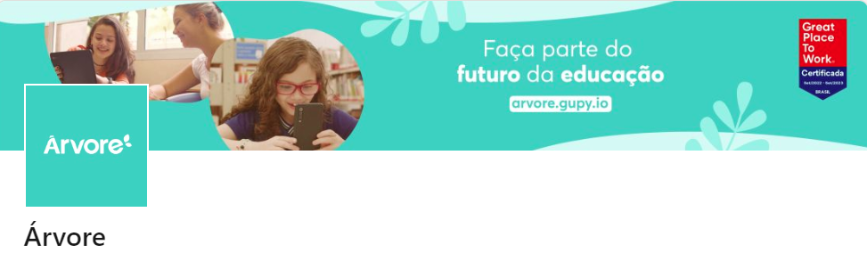
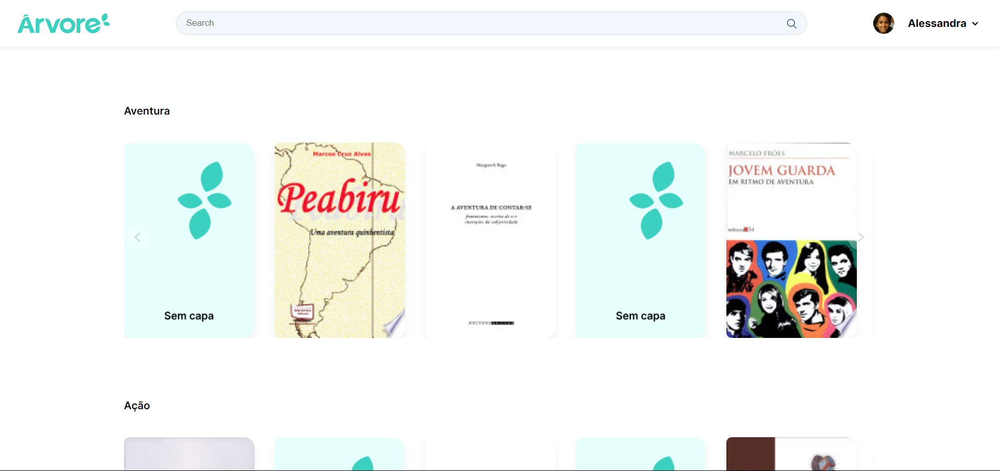
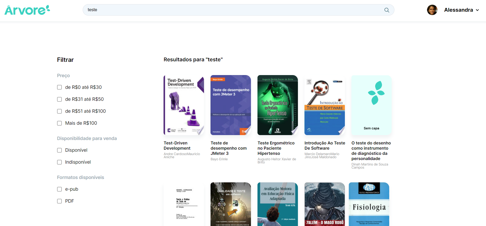

<h1 align="center">
  
</h1>

<h1 align="center">Teste Frontend Pleno Árvore</h1>

<p align="center">🚀 Projeto desenvolvido como parte do processo seletivo para desenvolvedor Frontend React para a grande EdTech Árvore.</p>

Tabela de conteúdos
=================
<!--ts-->
   * [Sobre](#Sobre)
   * [Tabela de Conteúdo](#tabela-de-conteudo)
   * [Instalação](#instalacao)
   * [Como usar](#como-usar)
      * [Pre Requisitos](#pre-requisitos)
   * [Tecnologias](#tecnologias)
   * [Autor](#autor)
<!--te-->

<h4 align="center">
	🚧  🚀 Finalizado dentro do prazo prometido...  🚧
</h4>

### Features

- [x] Layout Desktop
- [x] Layout Mobile
- [x] Prateleira de livros em carrousel
- [x] Pesquisa por nome ou palavras
- [x] Filtragem por preços, disponibilidade e tipo.
- [x] Scroll vertical infinito


<h1 align="center">
  
</h1>
<h1 align="center">
  
</h1>

### Pré-requisitos

Antes de começar, você vai precisar ter instalado em sua máquina as seguintes ferramentas:
[Git](https://git-scm.com), [Node.js](https://nodejs.org/en/).
Além disto é bom ter um editor para trabalhar com o código como [VSCode](https://code.visualstudio.com/)

### 🎲 Rodando o projeto

```bash
# Clone este repositório
$ git clone <https://github.com/ericsporto/frontend-test-arvore.git>

# Acesse a pasta do projeto no terminal/cmd ou abra direito no vscode
$ cd pasta do projeto

# Instale as dependências
$ yarn

# Execute a aplicação em modo de desenvolvimento
$ yarn dev

```

### 🛠 Tecnologias

As seguintes ferramentas foram usadas na construção do projeto:

- [Node.js](https://nodejs.org/en/)
- [Vite](https://vitejs.dev/guide/)
- [React](https://pt-br.reactjs.org/)
- [TypeScript](https://www.typescriptlang.org/)
- [Styled Components](https://styled-components.com/docs)
- [React Query](https://react-query-v3.tanstack.com/)
- [Axios](https://axios-http.com/docs/intro)


### Autor
---

Feito com ❤️ por Eric Porto 👋🏽

 [](https://www.linkedin.com/in/ericsporto/)
[](mailto:ericsporto@gmail.com)
